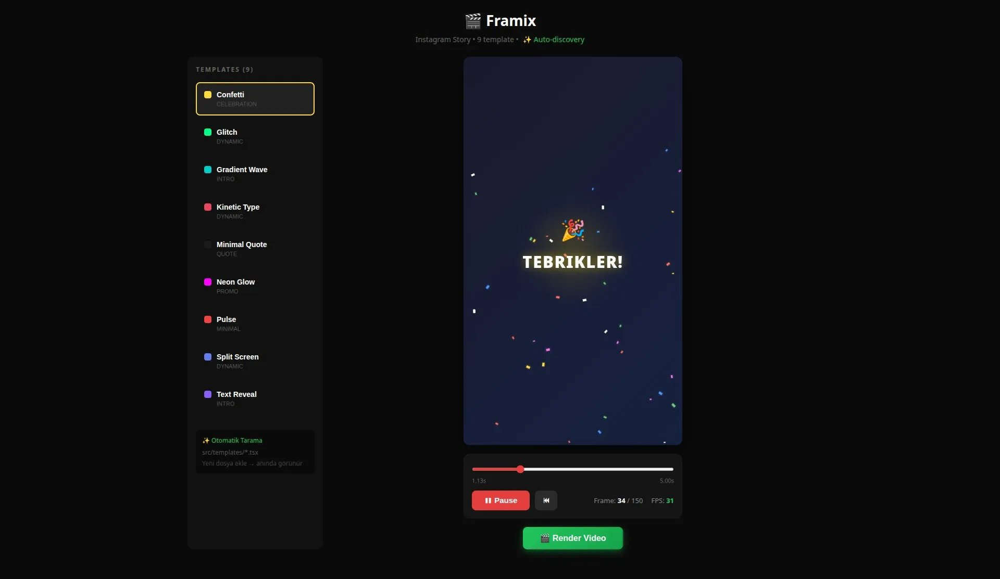

# Framix

Video animation render platform with real-time WebSocket progress tracking. Create programmatic video animations with React components and render them to MP4.



## Features

- **Template Gallery** - 9+ ready-to-use animation templates
- **Live Preview** - Real-time animation playback in browser
- **Parallel Rendering** - Multi-worker Puppeteer rendering
- **WebSocket Progress** - Real-time render progress with ETA
- **Auto-discovery** - Drop templates in `src/templates/` and they appear automatically

## Tech Stack

- **Frontend**: React 19, TypeScript, Vite
- **Backend**: Bun HTTP server, WebSocket
- **Rendering**: Puppeteer (headless Chrome), FFmpeg

## Getting Started

```bash
# Install dependencies
bun install

# Start development (frontend + backend)
bun run dev:full

# Or run separately
bun run dev      # Vite dev server
bun run server   # API + WebSocket server
```

## Usage

1. Open `http://localhost:4200`
2. Select a template from the sidebar
3. Preview with Play/Pause controls
4. Click **"Render Video"** button
5. Watch real-time progress
6. Download the rendered MP4

## API Endpoints

| Endpoint | Method | Description |
|----------|--------|-------------|
| `/api/render` | POST | Start render job `{ templateId }` |
| `/api/jobs/:id` | GET | Get job status |
| `/ws` | WebSocket | Real-time progress updates |

## Creating Templates

Add a new `.tsx` file in `src/templates/`:

```tsx
import type { AnimationProps } from "../animations";
import type { TemplateMeta } from "./types";

export const meta: TemplateMeta = {
  id: "my-template",
  name: "My Template",
  category: "intro",
  color: "#8b5cf6",
};

export const MyTemplate: React.FC<AnimationProps> = ({ frame, config }) => {
  // Your animation logic here
  return <div>Frame: {frame}</div>;
};
```

## Scripts

| Script | Description |
|--------|-------------|
| `bun run dev` | Start Vite dev server |
| `bun run server` | Start API server |
| `bun run dev:full` | Start both servers |
| `bun run render` | CLI render (default template) |
| `bun run build` | Production build |

## License

MIT
